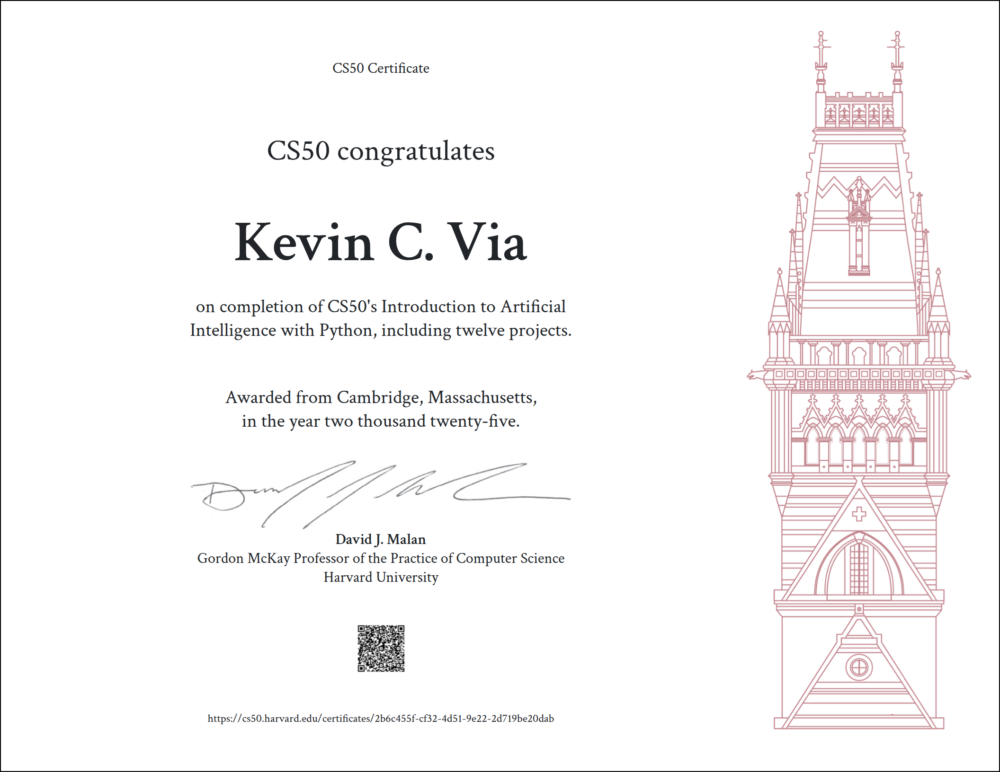

# Harvard CS50: Introduction to Artificial Intelligence with Python

Welcome to my project portfolio for [HarvardX CS50AI](https://cs50.harvard.edu/ai/2020/), an intensive, project-based course exploring the foundational concepts behind artificial intelligence and machine learning using Python.

---

## 🧠 Course Overview

This course introduced key AI topics including:

- **Search algorithms** (e.g., BFS, DFS)
- **Knowledge representation and logic**
- **Bayesian networks**
- **Machine learning** (scikit-learn)
- **Natural language processing**
- **Neural networks** (TensorFlow)
- **Reinforcement learning** (Q-learning)
- **Attention and Transformers**

Each project reinforced a specific domain through practical application and implementation in Python.

---

## 📁 Projects

| Folder | Project Title | Focus |
|--------|---------------|-------|
| `degrees-graph-search` | Degrees | Graph search (BFS) |
| `tictactoe-minimax` | Tic-Tac-Toe | Minimax & Game AI |
| `knights-logic-puzzle` | Knights | Propositional logic |
| `minesweeper-logic-ai` | Minesweeper | Logical inference |
| `heredity-bayes` | Heredity | Probability & Bayes Nets |
| `pagerank-algorithm` | PageRank | Link analysis |
| `shopping-classifier` | Shopping | Machine learning (k-NN) |
| `nim-qlearning` | Nim | Reinforcement learning |
| `traffic-neural-networks` | Traffic | Neural networks & TensorFlow |
| `questions-qa-rag` | Questions | NLP & question answering |
| `crossword-csp` | Crossword | Constraint satisfaction problems |
| `attention-bert-viz` | Attention | BERT & transformer visualization |

---

## 🛠️ Technologies Used

- Python 3.10
- TensorFlow
- scikit-learn
- PyTorch (select projects)
- NLTK
- HuggingFace Transformers
- Matplotlib, PIL

---

## 📜 Certificate

Proudly completed and verified through edX:

---

## 🔗 Author

**Kevin C. Via**  
[GitHub @59LesPaulMan](https://github.com/59LesPaulMan)  
LinkedIn and credentials available on request.